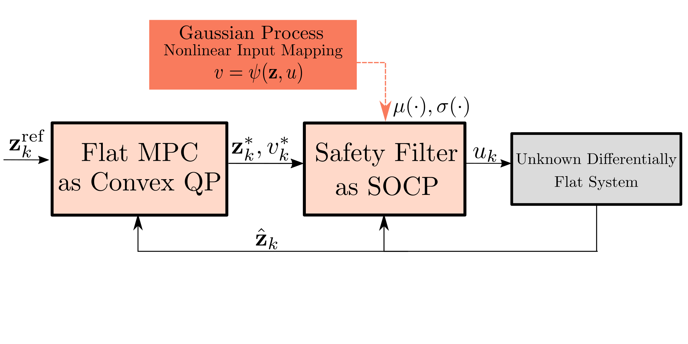

# Differentially Flat Learning-based Model Predictive Control Using a Stability, State, and Input Constraining Safety Filter
This repo containts the code to reproduce the expierements in the paper "Differentially Flat Learning-based Model Predictive Control Using a Stability, State, and Input Constraining Safety Filter".



Learning-based optimal control algorithms control unknown systems using past trajectory data and a learned model of the system dynamics.
These controllers use either a linear approximation of the learned dynamics, trading performance for faster computation, or nonlinear optimization methods, which typically perform better but can limit real-time applicability.
In this work, we present a novel nonlinear controller that exploits differential flatness to achieve similar performance to state-of-the-art learning-based controllers but with significantly less computational effort.
Differential flatness is a property of dynamical systems whereby nonlinear systems can be exactly linearized through a nonlinear input mapping.
Here, the nonlinear transformation is learned as a Gaussian process and is used in a safety filter that guarantees, with high probability, stability as well as input and flat state constraint satisfaction.
This safety filter is then used to refine inputs from a flat model predictive controller to perform constrained nonlinear learning-based optimal control through two successive convex optimizations.
We compare our method to state-of-the-art learning-based control strategies and achieve similar performance, but with significantly better computational efficiency, while also respecting flat state and input constraints, and guaranteeing stability.

## Installation and setup
TBD

## Generating Data
To generate the data used for Figure 1a in the paper,
```
cd experiments
python3 comparison_experiments.py
```
This will take a couple of minutes to run and will generate three plots.
The first plot of each of the states along the trajectory, the second is just of the position, and the third plot is a comparison of RMSE.

To generate the data used for Figure 1b
```
cd experiments
python3 comparison_input_step_comparison.py
```

To generate the data used for Figure 1c
```
cd experiments
python3 constrained_step_comparison.py
```

All results will be put into `experiments/results/<experiment tag>`.
